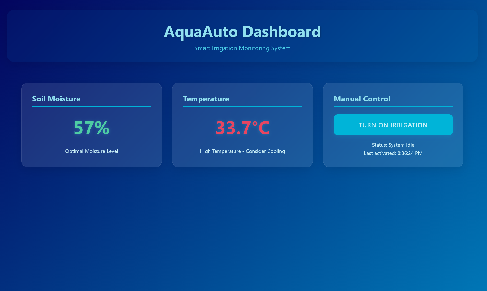

# AutoAqua - Smart Irrigation Monitoring System

AutoAqua is a modern web-based dashboard for monitoring and controlling automated irrigation systems. It provides real-time monitoring of soil moisture levels, temperature readings, and manual control capabilities for irrigation management.



## Features

-  Real-time monitoring of soil moisture levels
-  Temperature tracking with status indicators
-  Manual irrigation control system
-  Automated watering recommendations
-  Responsive design for all devices
-  Modern blue-themed UI with glassmorphism effects

## Tech Stack

- **Frontend**: React + Vite
- **Styling**: CSS3 with custom properties
- **State Management**: React Hooks
- **Build Tool**: Vite

## Getting Started

### Prerequisites

- Node.js (v14 or higher)
- npm or yarn

### Installation

1. Clone the repository:
   ```bash
   git clone https://github.com/KushalM23/AutoAqua.git
   cd AutoAqua
   ```

2. Install frontend dependencies:
   ```bash
   cd frontend
   npm install
   ```

3. Start the development server:
   ```bash
   npm run dev
   ```

4. Open your browser and navigate to `http://localhost:5173`

## Project Structure

```
frontend/
├── src/
│   ├── components/
│   │   ├── Dashboard.jsx
│   │   ├── Header.jsx
│   │   ├── MoistureSensor.jsx
│   │   ├── TemperatureSensor.jsx
│   │   └── ManualControl.jsx
│   ├── App.jsx
│   ├── App.css
│   └── main.jsx
├── public/
└── package.json
```

## Contributing

1. Fork the repository
2. Create your feature branch (`git checkout -b feature/AmazingFeature`)
3. Commit your changes (`git commit -m 'Add some AmazingFeature'`)
4. Push to the branch (`git push origin feature/AmazingFeature`)
5. Open a Pull Request

## License

This project is licensed under the MIT License - see the [LICENSE](LICENSE) file for details.

## Support

For support, please open an issue in the GitHub repository.